### 🛠️ Tech Stack

  
   
  

  
  
  
  
  
  

### 🚀 Featured Work

- **[Eva](https://github.com/anushkasalvi23/AI-Voice-Cloning)** — self-hosted AI voice cloning studio: clone a voice from ~10s of audio with XTTS-v2 and generate speech from any text (React · FastAPI · PyTorch)
- **[SumDoc — Document Analysis API](https://github.com/anushkasalvi23/Document-Analysis-API)** — upload PDFs, Word docs, or images and get AI-powered analysis, with OCR for scanned files (FastAPI · React · MongoDB) · [Live →](https://document-analysis-api-pi.vercel.app)
- **[Keizeku UI](https://github.com/anushkasalvi23/REPO_NAME)** — ADD ONE-LINE DESCRIPTION
- **SAR Narrative Generator** — LangGraph agent with human-in-the-loop review that drafts regulator-compliant SAR reports, cutting 5–6 hours of manual work to minutes

### 📄 Research & Achievements

| | |
|---|---|
| 📄 **Publication** | *Real-Time CCTV-Based Framework for Automated Traffic Accident Detection Using Deep Learning* — AIR 2026, Nazarbayev University |
| 💼 **Experience** | SDE Intern @ Linkcode Technologies · Graphic Designer Intern @ Lumenith Technology |
| 🎖️ **Certifications** | Deloitte Technology Job Simulation (Forage) · Anthropic AI Fluency Framework |

### 📫 Connect

  
  
  

  

